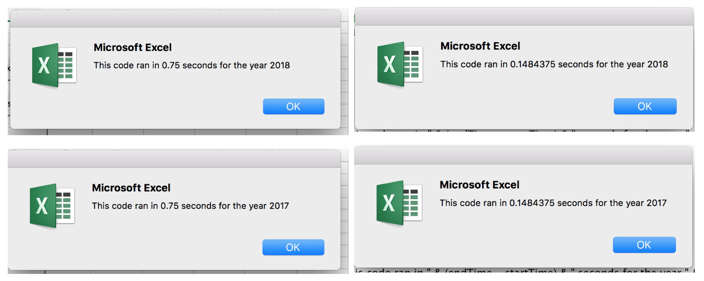

# Stock Analysis

## Overview of Project

### Purpose

Data for various stocks has been gathered for two different years: 2017 and 2018. The purpose of this analysis is to create and refactor code in VBA to analyze the total traded volume and the return for any given stock in a specific year.

## Results

### The Code

The following VBA code was used to calculate the total volume traded for each ticker, deterime the return over the given year, and output formatted results for all the stocks in a singular output sheet:

    Sub AllStocksAnalysisRefactored()
    Dim startTime As Single
    Dim endTime  As Single

    yearValue = InputBox("What year would you like to run the analysis on?")

    startTime = Timer
    
    'Format the output sheet on All Stocks Analysis worksheet
    Worksheets("All Stocks Analysis").Activate
    
    Range("A1").Value = "All Stocks (" + yearValue + ")"
    
    'Create a header row
    Cells(3, 1).Value = "Ticker"
    Cells(3, 2).Value = "Total Daily Volume"
    Cells(3, 3).Value = "Return"

    'Initialize array of all tickers
    Dim tickers(12) As String
    
    tickers(0) = "AY"
    tickers(1) = "CSIQ"
    tickers(2) = "DQ"
    tickers(3) = "ENPH"
    tickers(4) = "FSLR"
    tickers(5) = "HASI"
    tickers(6) = "JKS"
    tickers(7) = "RUN"
    tickers(8) = "SEDG"
    tickers(9) = "SPWR"
    tickers(10) = "TERP"
    tickers(11) = "VSLR"
    
    'Activate data worksheet
    Worksheets(yearValue).Activate
    
    'Get the number of rows to loop over
    RowCount = Cells(Rows.Count, "A").End(xlUp).Row
    
    '1a) Create a ticker Index
    tickerindex = 0

    '1b) Create three output arrays
    Dim tickerVolumes(12) As Long
    Dim tickerStartingPrices(12) As Single
    Dim tickerEndingPrices(12) As Single
    
    ''2a) Create a for loop to initialize the tickerVolumes to zero.
    For j = 0 To 11
        tickerVolumes(j) = 0
    Next j
            
    ''2b) Loop over all the rows in the spreadsheet.
                Worksheets(yearValue).Activate
                For i = 2 To RowCount
    '3a) Increase volume for current ticker
                tickerVolumes(tickerindex) = tickerVolumes(tickerindex) + Cells(i, 8).Value
            
    '3b) Check if the current row is the first row with the selected tickerIndex.
                If Cells(i, 1).Value = tickers(tickerindex) And Cells(i - 1, 1).Value <> tickers(tickerindex) Then
                    tickerStartingPrices(tickerindex) = Cells(i, 6).Value
                End If
    '3c) check if the current row is the last row with the selected ticker
         'If the next row’s ticker doesn’t match, increase the tickerIndex.
                If Cells(i, 1).Value = tickers(tickerindex) And Cells(i + 1, 1).Value <> tickers(tickerindex) Then
                    tickerEndingPrices(tickerindex) = Cells(i, 6).Value
                End If
                
            '3d Increase the tickerIndex.
                If Cells(i, 1).Value = tickers(tickerindex) And Cells(i + 1, 1).Value <> tickers(tickerindex) Then
                    tickerindex = tickerindex + 1
                End If
    
    Next i
    
    '4) Loop through your arrays to output the Ticker, Total Daily Volume, and Return.
    For i = 0 To 11
        Worksheets("All Stocks Analysis").Activate
        Cells(4 + i, 1).Value = tickers(i)
        Cells(4 + i, 2).Value = tickerVolumes(i)
        Cells(4 + i, 3).Value = tickerEndingPrices(i) / tickerStartingPrices(i) - 1
        
    Next i
    
    'Formatting
    Worksheets("All Stocks Analysis").Activate
    Range("A3:C3").Font.FontStyle = "Bold"
    Range("A3:C3").Borders(xlEdgeBottom).LineStyle = xlContinuous
    Range("B4:B15").NumberFormat = "#,##0"
    Range("C4:C15").NumberFormat = "0.0%"
    Columns("B").AutoFit

    dataRowStart = 4
    dataRowEnd = 15
    'Color cells greater than 0 green, and those less than zero red
    For i = dataRowStart To dataRowEnd
        
        If Cells(i, 3) > 0 Then
            
            Cells(i, 3).Interior.Color = vbGreen
            
        Else
        
            Cells(i, 3).Interior.Color = vbRed
            
        End If
        
    Next i
 
    endTime = Timer
    'Display the run time for the code
    MsgBox "This code ran in " & (endTime - startTime) & " seconds for the year " & (yearValue)

    End Sub

The Results for 2017 and 2018 are listed below:

## Summary

There are various advantages and disadvantages for refactoring code, or editing established code to accomlish a new task or combine actions. Refactoring code can allow the analysis to run more efficently. This means the analysis won't take as long, which can be essential when analyzing extremely large sets of data. However, refactoring can introduce risk and more bugs in the code that could lead to problems later when running the analysis.

In this case, refactoring the original code allowed the code to run faster: the refactored coded runs in 0.15 seconds vs. 0.75 seconds. While this may seem like a small differences, this can be a major factor when analyzing larger datasets with thousands and thousands of rows of data. While the code does run faster, the refactored code accomplishs essentially the analysis as the original - if time is of the essence, it may not be of interest to refactor code.

